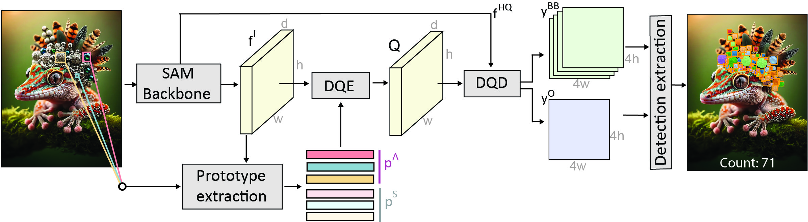

# GeCo (A Novel Unified Architecture for Low-Shot Counting by Detection and Segmentation)

> ⚠️ **Note:** This repository contains the original **GeCo** implementation from our NeurIPS 2024 paper.  
> A newer and improved version, **GeCo2**, is now available with **faster inference, lower GPU requirements, training on more data, and stronger performance**.  
>
> 👉 **GeCo2 repository:** https://github.com/jerpelhan/GECO2  
> 👉 **Interactive demo:** https://huggingface.co/spaces/jerpelhan/GECO2-demo/
>
> If you are starting a new project, we recommend using **GeCo2**.


This repository holds the official Pytorch implementation for the paper [A Novel Unified Architecture for Low-Shot Counting by Detection and Segmentation](https://arxiv.org/pdf/2409.18686) accepted at NeurIPS 2024.


https://github.com/user-attachments/assets/cbdd1fbb-5b07-43c0-95e4-6bf0e5b2896a


## Abstract
Low-shot object counters estimate the number of objects in an image using few or no annotated exemplars. Objects are localized by matching them to prototypes, which are constructed by unsupervised image-wide object appearance aggregation. Due to potentially diverse object appearances, the existing approaches often lead to overgeneralization and false positive detections. 
Furthermore, the best-performing methods train object localization by a surrogate loss, that predicts a unit Gaussian at each object center. This loss is sensitive to annotation error, hyperparameters and does not directly optimize the detection task, leading to suboptimal counts.We introduce GeCo, a novel low-shot counter that achieves accurate object detection, segmentation, and count estimation in a unified architecture. GeCo robustly generalizes the prototypes across objects appearances through a novel dense object query formulation. In addition, a novel counting loss is proposed, that directly optimizes the detection task and avoids the issues of the standard surrogate loss. GeCo surpasses the leading few-shot detection-based counters by ~25\% in the total count MAE, achieves superior detection accuracy and sets a new solid state-of-the-art result across all low-shot counting setups. 



## Quick demo

To install the required dependencies, run the following command:

```bash
conda create -n geco_test python=3.8
conda activate geco_test
pip install torch torchvision torchaudio --index-url https://download.pytorch.org/whl/cu118
pip install matplotlib
```

To run the demo, you need to download the [pretrained weights](https://drive.google.com/file/d/1wjOF9MWkrVJVo5uG3gVqZEW9pwRq_aIk/view?usp=sharing) and put them in the `MODEL_folder`.

**Run the demo:**

```bash
python demo.py --image_path ./material/4.jpg --output_masks
```


## Evaluation on FSC147

To evaluate GeCo on FSC147, install also:

```bash 
pip install tqdm
pip install pycocotools
pip install scipy
python -m pip install 'git+https://github.com/facebookresearch/detectron2.git'
```

download all the required data:
1. The original FSC147 dataset from [Learning to Count Everything](https://drive.google.com/file/d/1ymDYrGs9DSRicfZbSCDiOu0ikGDh5k6S/view?usp=sharing) (put in the `DATA_folder`),

2. Box annotations for validation and test split from [Counting-DETR](https://drive.google.com/drive/folders/1Jvr2Bu2cD_yn4W_DjKIW6YjdAiUsw_WA) (put in the `DATA_folder/annotations`),

3. [**Pretrained weights**](https://drive.google.com/file/d/1wjOF9MWkrVJVo5uG3gVqZEW9pwRq_aIk/view?usp=sharing) (put in the `MODEL_folder`).

and compute density maps: 
```bash
python utils/data.py --data_path DATA_folder
```
(Need to compute density maps due to FSCD147 incompatibility with the original FSC147 annotations.)

**Run inference on FSC147:**

```bash
python evaluate.py --data_path DATA_folder --model_path MODEL_folder
```
**Run bbox evaluation on FSC147:**

```bash
python evaluate_bboxes.py --data_path DATA_folder
```


### Training

To train the model, follow the steps for evaluation on FSC147, correct paths in `train.sh` and `pretrain.sh`, download box annotations for [train split](https://drive.google.com/file/d/15_qpEZ7f0ZBrcTmgFnxx71lCdxAGtuTz/view?usp=sharing), put them in `DATA_folder`, SAM-HQ pretrained [weights](https://drive.google.com/file/d/1qobFYrI4eyIANfBSmYcGuWRaSIXfMOQ8/view?usp=sharing), put them in `MODEL_folder` and run the following commands:

First, generate density maps:
```bash
python utils/data.py
```

First run pretraining:
```bash
sbatch pretrain.sh
```

then run the main training:
```bash
sbatch train.sh
```

## Citation
```bash
@article{pelhan2024novel,
  title={A Novel Unified Architecture for Low-Shot Counting by Detection and Segmentation},
  author={Pelhan, Jer and Lukezic, Alan and Zavrtanik, Vitjan and Kristan, Matej},
  journal={Advances in Neural Information Processing Systems},
  volume={37},
  pages={66260--66282},
  year={2024}
}
```

## Possible applications


https://github.com/user-attachments/assets/e61c791d-389a-486e-a1bd-3713455df0a9


