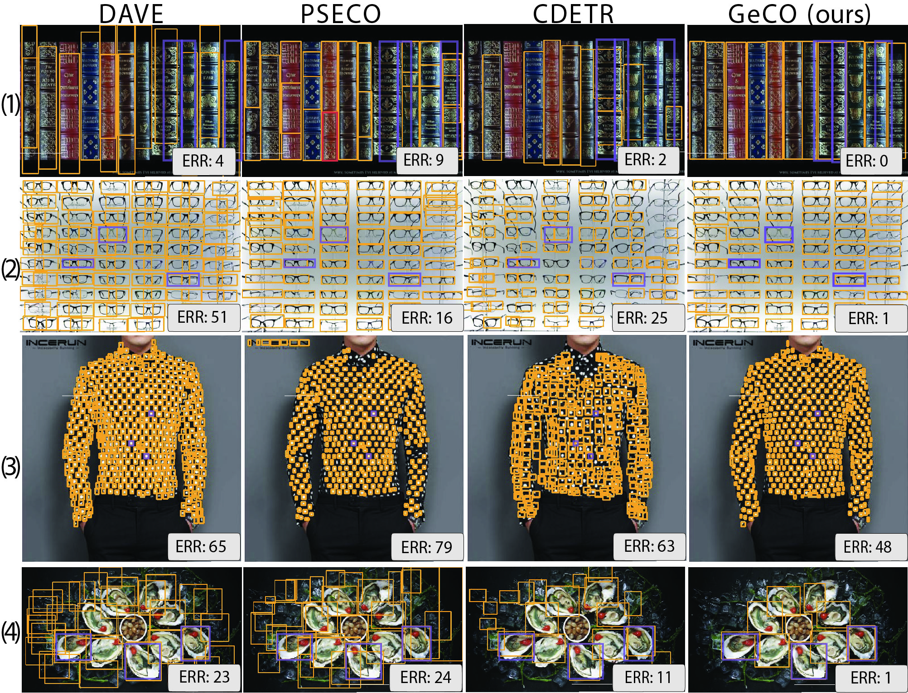

# GeCo (A Novel Unified Architecture for Low-Shot Counting by Detection and Segmentation)

This repository holds the official Pytorch implementation for the paper [A Novel Unified Architecture for Low-Shot Counting by Detection and Segmentation](https://arxiv.org/pdf/2409.18686) accepted at NeurIPS 2024.

Code will be released in time for the conference.

## Abstract
Low-shot object counters estimate the number of objects in an image using few or no annotated exemplars. Objects are localized by matching them to prototypes, which are constructed by unsupervised image-wide object appearance aggregation. Due to potentially diverse object appearances, the existing approaches often lead to overgeneralization and false positive detections. 
Furthermore, the best-performing methods train object localization by a surrogate loss, that predicts a unit Gaussian at each object center. This loss is sensitive to annotation error, hyperparameters and does not directly optimize the detection task, leading to suboptimal counts.We introduce GeCo, a novel low-shot counter that achieves accurate object detection, segmentation, and count estimation in a unified architecture. GeCo robustly generalizes the prototypes across objects appearances through a novel dense object query formulation. In addition, a novel counting loss is proposed, that directly optimizes the detection task and avoids the issues of the standard surrogate loss. GeCo surpasses the leading few-shot detection-based counters by ~25\% in the total count MAE, achieves superior detection accuracy and sets a new solid state-of-the-art result across all low-shot counting setups. 

